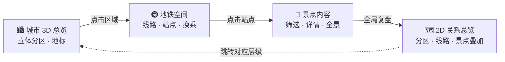

#  长春地铁文旅四层联动平台

**以「城市区域 → 地铁线路 → 沿线景点 → 2D 全局关系」四层递进视角，沉浸式探索长春的文旅空间关系。**

一个基于 Three.js + React 的沉浸式城市文旅 Web 原型：不是孤立地看景点列表，而是让用户沿着地铁线路完成一次有方向的城市探索。


## ✨ 四层空间叙事



四层不是四个独立页面，而是围绕同一份共享数据（统一 ID 体系）的逐级聚焦 — 任意层级的选中对象在切换时保持高亮，URL 状态可刷新恢复、可分享。

## 🎯 核心功能

| 功能 | 说明 |
| --- | --- |
| 🏙️ 3D 城市总览 | Three.js 程序化城市：六区分色、地标浮动、点击聚焦 |
| 🚇 地铁空间 | 7 条线路 140 站、换乘共点、标签屏幕空间避让、线路聚焦镜头 |
| 📸 景点内容 | 23 个景点、四维筛选（站点/线路/区域/类别）、主题一日线 |
| 🗺️ 2D 关系总览 | SVG 叠加图、图层开关、跨层跳转 |
| 🔍 全局搜索 | 区域/线路/站点/景点全量索引，支持键盘导航 |
| 📱 详情抽屉 | 图文详情、内嵌视频、**360° 全景拖拽查看器**、美食与交通指引 |
| 🔗 状态分享 | 任意视图一键复制链接，刷新后完整恢复 |

## 🚀 快速开始

```bash
cd changchun-metro-demo
npm install
npm run dev        # http://localhost:5173
```

## ✅ 质量检查

```bash
npm run lint          # oxlint 静态检查
npm run check:data    # 数据一致性校验（换乘共点 / 引用有效性）
npm run build         # 3D 层按需分包，首屏 gzip ≈ 84 KB

# MVP 验收：PRD 三条典型任务链路（需 dev server 运行中）
python scripts/acceptance.py
```

## 🏗️ 架构速览

```
changchun-metro-demo/src/
├── store/useStore.js     # 唯一状态源：层级 / 选中对象 / URL 同步
├── layers/               # 四层视图（City · Metro · Poi · Map2D）
├── three/                # Three.js 场景（标签避让 / 射线拾取 / 镜头动画）
├── components/           # 搜索、详情抽屉、2D 地图、图例等
└── data/                 # JSON 数据源 + API 封装（districts / metro-lines / pois / themes / media）
```

详细的数据约定与协作规范见 [changchun-metro-demo/README.md](changchun-metro-demo/README.md)。

## 🗺️ Roadmap

- **V1.1** — 真实图片/视频/全景素材接入、收藏与分享增强、站点出入口信息
- **V2.0** — 真实 GIS / 3D 资产（GLB）、实时地铁数据、多日行程规划

---

> 本项目为原型阶段（Demo），演示数据以官方发布为准 · 产品需求文档见仓库根目录
